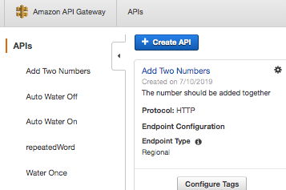
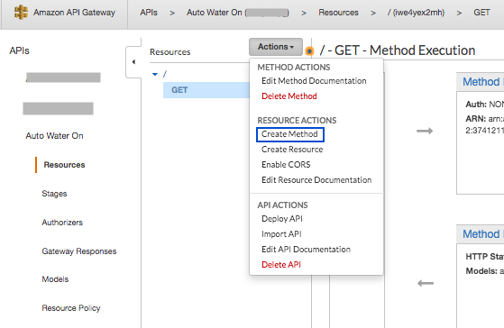
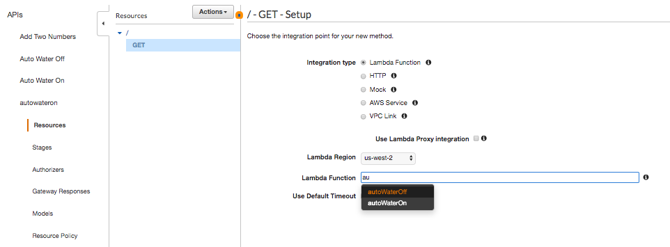

[Back](./README.md)

# AWS API Gateway Documentation

This document contains a step by step setup with AWS API Gateway.

## Author

Liz Mahoney

## Getting Started

1. Go to the AWS API Gateway console and select ***Create API***

2. In the Form: 
- ***Choose the Protocol*** : Select ***REST***
- ***Create new API***: Select ***New API***
- Under ***Settings***:
    - ***API name***: Enter `Auto Water On`
    - ***Endpoint Type***: Select ***Regional***
    - Click ***Create API***
    
3. The page loads to create a get method, click on ***Actions*** tab and select ***Create Method***

4. In the ***Get - Setup*** page:
    - Select the appropriate Lambda (*ie. autoWaterON*) to trigger the lambda function.
    - Save the Setup
    - Click ***OK*** to Add Permission to Lambda Function.
    

5. Click on the ***Actions*** tab, Under ***API actions***, select ***Deploy API***.
6. ***Deployment Stage*** : Select ***[New Stage]***
7. Enter ***Stage Name*** (i.e. auto_water_on)
8. Enter ***Stage Description*** (*i.e 'API triggers water to turn on automatically'*)
9. Click ***Deploy***
10. On the page should display the deployed link, click on it to test it.

11. Repeat steps 2-10 to create auto water off and water once API.

## Resources
- [AWS API Gateway ](https://aws.amazon.com/api-gateway/)

