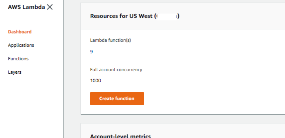

# AWS Lambda Documentation

This document contains a step by step setup with AWS Lambda.

## Author

Liz Mahoney

## Getting Started

1. Go to AWS Lambda Console, in the dashboard click on ***Create Function***



2. In the Create Function form:

- Check ***Author from scratch***
- In ***Basic Information***:
    - ***Enter Function name***: `autoWaterOn`
    - Under***Runtime***:  Select ***Node.js 8.10***
    - In ***Execution role***: Select ***Create a new role with basic Lambda permissions***
    - Click ***Create Function***
    
3. The page should display the `autoWaterOn` page.
4. Go to your Systems Manager console and go to ***Managed Instances*** on side menu, to retrieve the ***Instance 
ID*** associated with the SM Document so that Lambda can trigger that Document.
5. Paste the code below to the javascript environment editor:

```
'use strict'

const AWS = require('aws-sdk')
const ssm = new AWS.SSM()

exports.handler = () => {
  
  try{
       runCommand() 
  }catch(error) {
      reportFailure(error)
  }
}

const reportFailure = (failureMessage) => {
  const failureSnsTopic = process.env.FAILURE_SNS_TOPIC

  if(failureSnsTopic) {
    reportFailureToSns(failureSnsTopic, failureMessage)
  } else {
    console.log('Warning: no failure SNS defined.')
    console.log('Scheduled Job failed:', failureMessage)
  }
}

const reportFailureToSns = (topic, message) => {
  const sns = new AWS.SNS()

  return new Promise((resolve, reject) => {
    sns.publish({
      Message: message,
      Subject: 'Scheduled Job Failed',
      TopicArn: topic
    }, (err, data) => {
      if (err) {
        reject(err)
      } else {
        resolve(data)
      }
    })
  })
}

const runCommand = () => {
  ssm.sendCommand({
    DocumentName: "<SYSTEMS MANAGER DOCUMENT NAME HERE>",
    InstanceIds: [ "<SYSTEMS MANAGER INSTANCE ID HERE>" ],
    TimeoutSeconds: 3600
  }, function(err, data) {
    if (err) {
      reportFailure(JSON.stringify(err))
    } else {
      console.log(data)

    }
  })
}

```

6. Click the ***Save*** button and run ***Test***. This should execute the lambda function to trigger the systems 
manager document to run the script on the raspberry pi.

7. Repeat steps 2-6 for creating auto water off and water once lambda.

## Resources
- [Using AWS Systems Manager](https://medium.com/@simonrand_43344/using-aws-simple-systems-manager-and-lambda-to-replace-cron-in-an-ec2-auto-scaling-group-939d114ec9d7)

