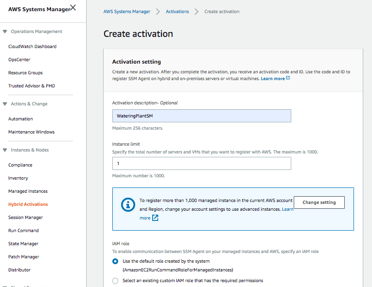
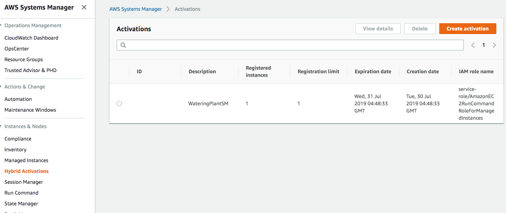
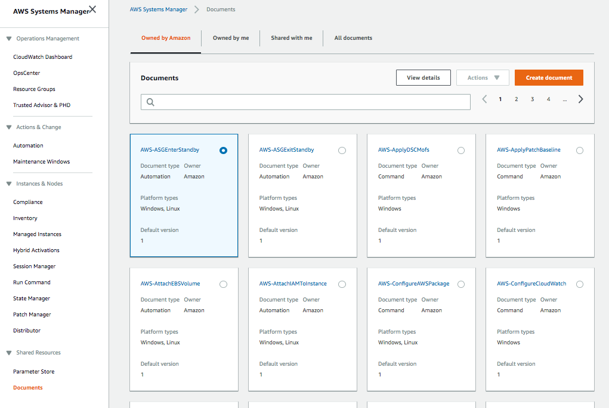
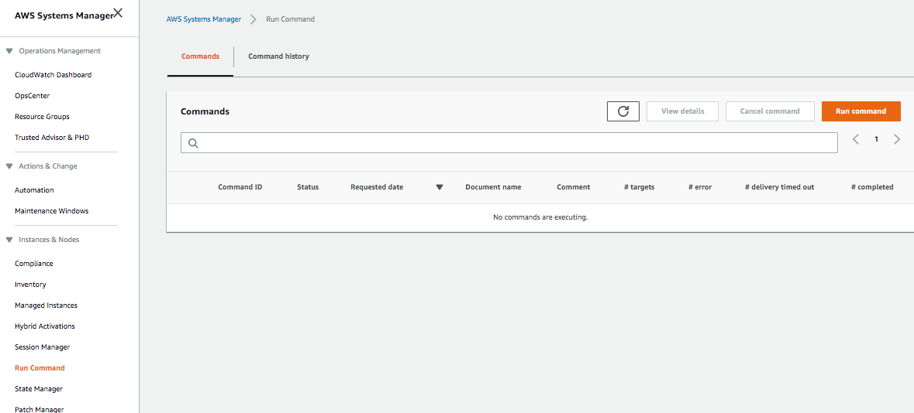

[Back](./README.md)

# AWS Systems Manager Documentation

This document contains a step by step setup with AWS Systems Manager. AWS EC2 Systems Manager (Systems Manager for short)
is an agent based platform for configuring, controlling, and governing on premise servers from within the EC2 console. 
By installing a Systems Manager agent on your server, you can execute commands remotely, ensure servers remain in 
specific state, and enforce configuration management requirements.

## Author

Liz Mahoney

## Getting started

1. Connecting your Raspberry Pi to Systems Manager requires a few steps:

    - Establish the necessary IAM permissions
    - Create an activation
    - Install agent and register with activation
    
2. Once the agent is up and running you can then perform Systems Manager operations such as:

    - Create a command
    - Run a command

3. Establish IAM permissions
    
    - Create an IAM Policy to attach to your role   
    
    ```
    {
        "Version": "2012-10-17",
        "Statement": [
            {
                "Effect": "Allow",
                "Action": [
                    "ssm:DescribeAssociation",
    
      "ssm:GetDeployablePatchSnapshotForInstance",
                    "ssm:GetDocument",
                    "ssm:GetParameters",
                    "ssm:ListAssociations",
                    "ssm:ListInstanceAssociations",
                    "ssm:PutInventory",
                    "ssm:PutComplianceItems",
                    "ssm:UpdateAssociationStatus",
                    "ssm:UpdateInstanceAssociationStatus",
                    "ssm:UpdateInstanceInformation"
                ],
                "Resource": "*"
            },
            {
                "Effect": "Allow",
                "Action": [
                    "ec2messages:AcknowledgeMessage",
                    "ec2messages:DeleteMessage",
                    "ec2messages:FailMessage",
                    "ec2messages:GetEndpoint",
                    "ec2messages:GetMessages",
                    "ec2messages:SendReply"
                ],
                "Resource": "*"
            },
            {
                "Effect": "Allow",
                "Action": [
                    "cloudwatch:PutMetricData"
                ],
                "Resource": "*"
            },
            {
                "Effect": "Allow",
                "Action": [
                    "ec2:DescribeInstanceStatus"
                ],
                "Resource": "*"
            },
            {
                "Effect": "Allow",
                "Action": [
                    "ds:CreateComputer",
                    "ds:DescribeDirectories"
                ],
                "Resource": "*"
            },
            {
                "Effect": "Allow",
                "Action": [
                    "logs:CreateLogGroup",
                    "logs:CreateLogStream",
                    "logs:DescribeLogGroups",
                    "logs:DescribeLogStreams",
                    "logs:PutLogEvents"
                ],
                "Resource": "*"
            },
            {
                "Effect": "Allow",
                "Action": [
                    "s3:PutObject",
                    "s3:GetObject",
                    "s3:AbortMultipartUpload",
                    "s3:ListMultipartUploadParts",
                    "s3:ListBucketMultipartUploads"
                ],
                "Resource": "*"
            },
            {
                "Effect": "Allow",
                "Action": [
                    "s3:ListBucket"
                ],
                "Resource": "arn:aws:s3:::amazon-ssm-packages-*"
            }
        ]
    }
    ```
    
    Once you have created the above IAM Policy, you need to create an IAM Role and attach that policy to the new Role.
    For the Role, you will need to specify a Trust Policy that enables Systems Manager to assume the role:
    
    ```
    {
      "Version": "2012-10-17",
      "Statement": [
        {
          "Effect": "Allow",
          "Principal": {
            "Service": "ssm.amazonaws.com"
          },
          "Action": "sts:AssumeRole"
        }
      ]
    }
    ```
    
    The IAM permissions necessary for your activation to execute successfully!   

4. Go to the AWS Systems Manager Console, on the side menu, click managed instances to ***Create Activation***

5. In the Create Activation Form
    - Enter a name  in ***Activation description***, 
    - Select ***Use the default role created by the system*** under  ***IAM Role*** 
    - Click ***Create activation***
    



6. On the side menu, click ***Managed Instances*** to view the new created instance.



7. To create a new document to turn auto water on:

- On the side menu under ***Shared Resources*** select ***Documents***
- Click ***Create document***



8. In the create document form: 

- Under Document details:
    - Name: AutoWaterOnDocument
    - Content: Select ***JSON***
    - Attach the below code:
    
        ```
        {
          "schemaVersion": "2.2",
          "description": "developer-update-raspbian",
          "mainSteps": [
            {
              "action": "aws:runShellScript",
              "name": "PatchLinux",
              "precondition": {
                "StringEquals": [
                  "platformType",
                  "Linux"
                ]
              },
              "inputs": {
                "runCommand": [
                  "sudo -u pi python3 <INSERT_ABSOLUTE_PATH>"
                ]
              }
            }
          ]
        }
        ```
    - Click ***Create Document***
    - Repeat steps 7, 8 to create auto water off and water once document.
   
## To Run Command for the new Document
 
1. On the side menu in the Systems Manager console, click ***Run Command***
 
    
 
2. In the ***Run a command*** form
 
    - In the search bar, enter: ***Owner by me***, a list of the new created documents should be listed, check 
    the document you want to run.
    - Check Document version is the same as the Document you just created
      
    - Under targets check ***Choose instances manually***, then select the checkbox under ***Instances***.
      
    - Uncheck ***Enable writing to an s3 bucket***
    
    - Click ***Run***

3. A ***Command status*** page should display with the Document running in progress, you can ***cancel command*** at 
any time.
 
## Resources

- [Using AWS Systems Manager](https://medium.com/@simonrand_43344/using-aws-simple-systems-manager-and-lambda-to-replace-cron-in-an-ec2-auto-scaling-group-939d114ec9d7)

- [Raspberry Pi remote Management WIth AWS ](https://blogs.sequoiainc.com/raspberry-pi-remote-management-with-aws-ec2-systems-manager/)


[Back](./README.md)