# IoT Documentation Setup

This documentation tutorial provides the step-by-step setup to use AWS IoT services such as SMS - sending text 
message,

# Author 

Liz Mahoney 

## Prerequisites

Must have completed the following:

- An AWS account
- An An IAM administrator user in the AWS account.

## Getting Started

### Step 1: Create the AWS IoT Policy

In this step, to allow the Raspberry Pi, or your development computer as a substitute simulator, to perform AWS IoT 
operations, you create an AWS IoT policy.

X.509 certificates are used to authenticate devices with AWS IoT . AWS IoT policies are used to authorize devices to 
perform AWS IoT operations, such as subscribing or publishing to MQTT topics.

If you use the Raspberry Pi hardware for this sample, the Raspberry Pi presents its certificate when sending messages 
to AWS IoT . If you use your development computer to simulate the soil moisture 
readings, your computer presents its certificate when sending messages to AWS IoT instead.

Later on, you attach the policy to a device certificate.

1. On the AWS navigation bar, choose the AWS Region where you want to create the AWS IoT resources in your AWS account. 
This sample was tested with the US West (Oregon) Region.

2. Open the AWS IoT console. To do this, on the AWS navigation bar, choose ***Services***. In the ***Find a service by name or 
feature*** box, enter ***IoT Core***, and then press ***Enter***.

3. In the AWS IoT console, if a ***Get started*** button appears, choose it.

4. In the service navigation pane, expand ***Secure***, and then choose ***Policies***.

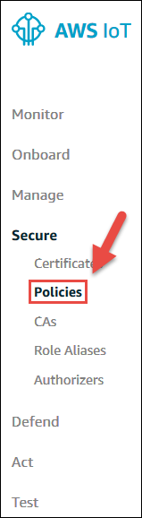

5. If a ***You don’t have any policies*** yet dialog box appears, choose ***Create a policy***. Otherwise, choose Create.

6. Provide a ***Name*** that represents this policy, for example ***PlantWateringPolicy***.

    - Note: If you choose to use a different name, be sure to substitute it throughout this sample.

7. For ***Action***, enter ***iot:* ***.

8. For ***Resource ARN***, replace the suggested value with an asterisk (*).

9. For ***Effect***, choose ***Allow***.

10. Choose ***Create***

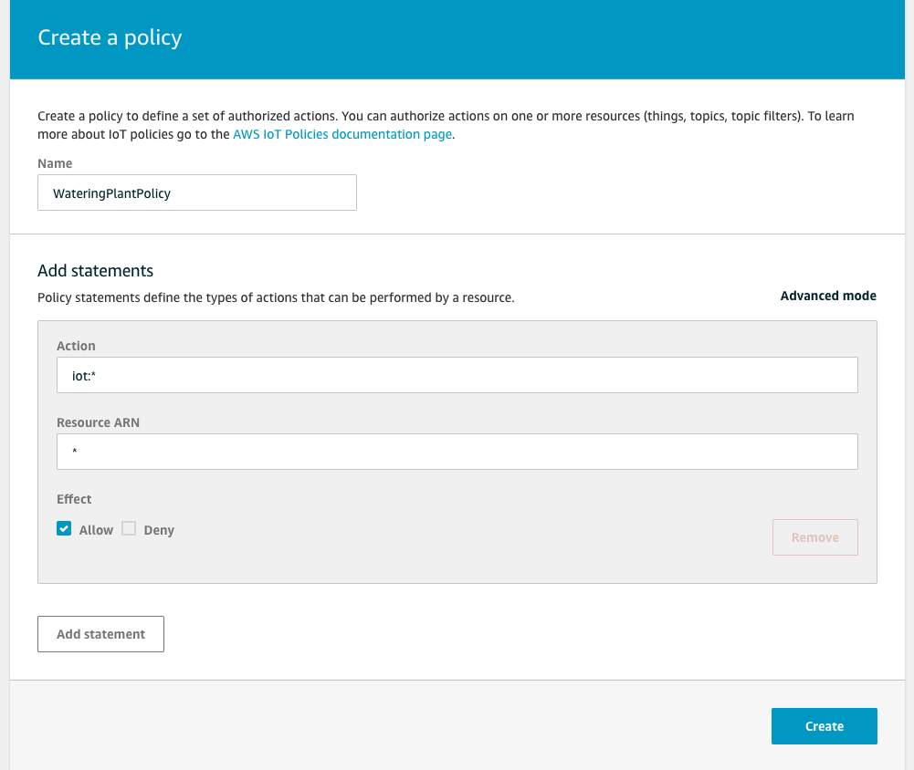

### Step 2: Create the Thing

Devices connected to AWS IoT are represented by things in the AWS IoT registry. The registry enables you to keep a 
record of all of the devices that are connected to your AWS account in AWS IoT .

1. With the AWS IoT console open, in the service navigation pane, choose ***Manage***.

2. If an ***Introducing AWS IoT Device Management*** dialog box is displayed, choose ***Show me later***, or press Esc.

3. In the service navigation pane, with ***Manage*** expanded, choose ***Things***.

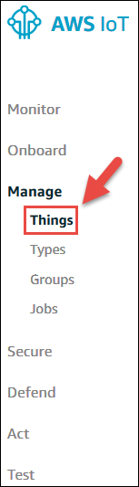
                           
4. If a ***You don’t have any things*** yet dialog box is displayed, choose ***Register a thing***. Otherwise, choose Create.

5. On the ***Creating AWS IoT things*** page, for ***Register a single AWS IoT thing***, choose ***Create a single 
thing***.

### Step 3: Send and Receive Test Data for the Thing

In this step, you practice sending test data to the device shadow for the Raspberry Pi (or your development computer as a device simulator). In a later step, you either send real data from the soil moisture sensor kit through the Raspberry Pi to its device shadow, or you send simulated data from your development computer to its device shadow.

A device's shadow is a JSON document, stored in AWS IoT , that AWS IoT uses to save and retrieve current state information for a device. The Device Shadow Service for AWS IoT maintains a shadow for each device you connect to AWS IoT . You can use the shadow to get and set the state of a device, regardless of whether the device is connected to the internet.

1. In the AWS IoT console, on the Things page, choose ***wateringPlant***.

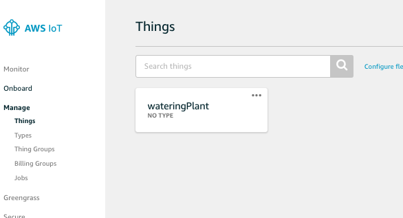

2. Choose ***Interact***.

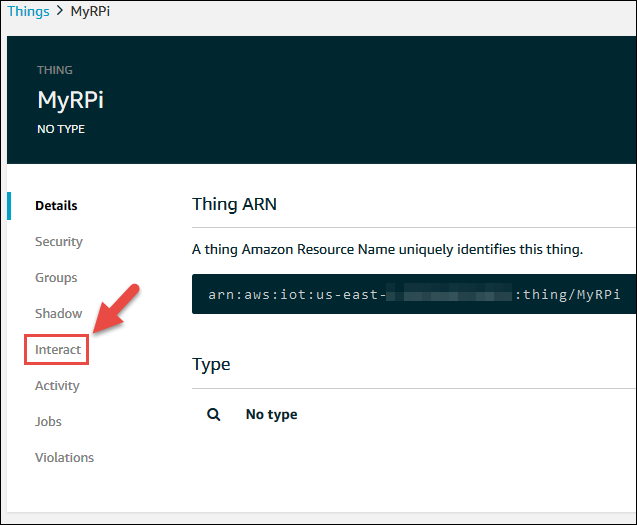

3. For MQTT, make a note of the value for each of the following MQTT topics, which enable you to set and get updates to
 the shadow:

- ***Update to this device shadow*** (for example, $aws/things/MyRPi/shadow/update)

- ***Get this device shadow*** (for example, $aws/things/MyRPi/shadow/get)

- ***Get this device shadow accepted*** (for example, $aws/things/MyRPi/shadow/get/accepted)

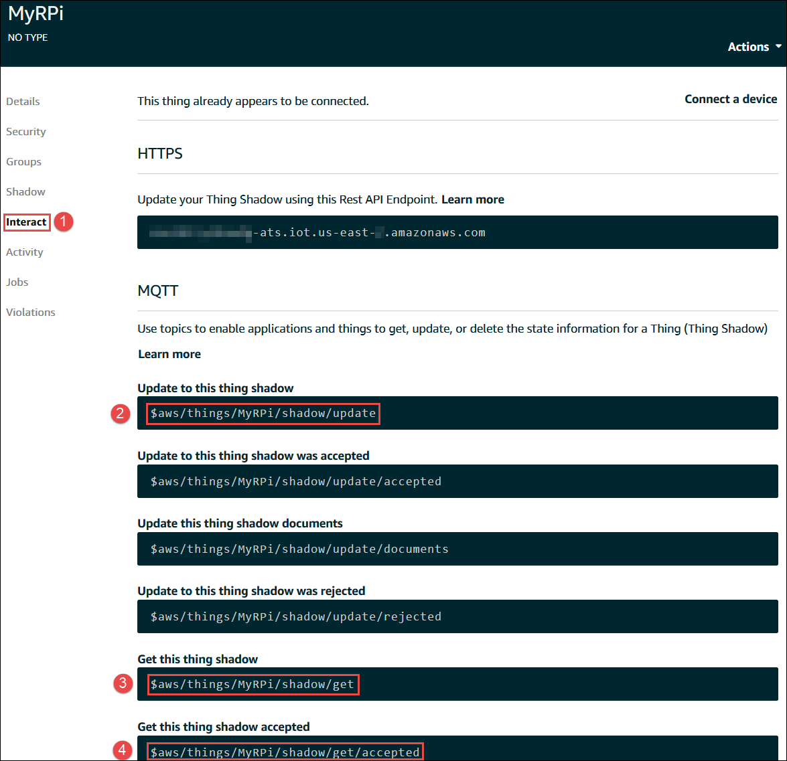

4. Choose the back button.

5. If an Introducing AWS IoT Device Management dialog box is displayed, choose Show me later, or press Esc.

6. In the service navigation pane, choose Test.

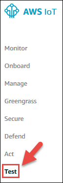

7. For ***Subscription topic***, enter the MQTT topic value that you noted in step 3 of this procedure for ***Update 
to this device shadow*** (for example, ***$aws/things/MyRPi/shadow/update***), and then choose ***Subscribe to topic***.

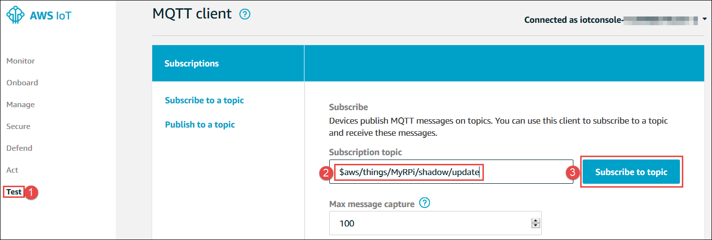

    ***Important!***
    If you named your thing something other than MyRPi, be sure to substitute your thing’s name for MyRPi 
    in the preceding MQTT topic name and other MQTT topic names throughout Step 3. Otherwise, the subscribed 
    MQTT topic won’t display any activity.

8. Choose ***Subscribe to a topic***.

9 . Repeat steps 7 and 8 in this procedure for the MQTT topic values that you noted for ***Get this device shadow*** 
(for example, ***$aws/things/MyRPi/shadow/get***) and ***Get this device shadow accepted***
 (for example, ***$aws/things/MyRPi/shadow/get/accepted***).

10. Now push some test data into the shadow. To do this, in the MQTT client navigation pane, choose the MQTT topic 
value for ***Update to this device shadow*** (for example, ***$aws/things/MyRPi/shadow/update***). You might need to 
pause your mouse over a truncated topic value to see its full value.

11. In the message payload area, replace the current payload with the following payload:

```
{
  "state": {
    "desired": {
      "welcome": null
    },
    "reported": {
      "welcome": null,
      "moisture": "low"
    }
  }
}
           
```

    The preceding payload removes the default welcome value for the shadow and adds a moisture 
    value with the value low to the shadow.
    
12. Choose ***Publish to topic***.

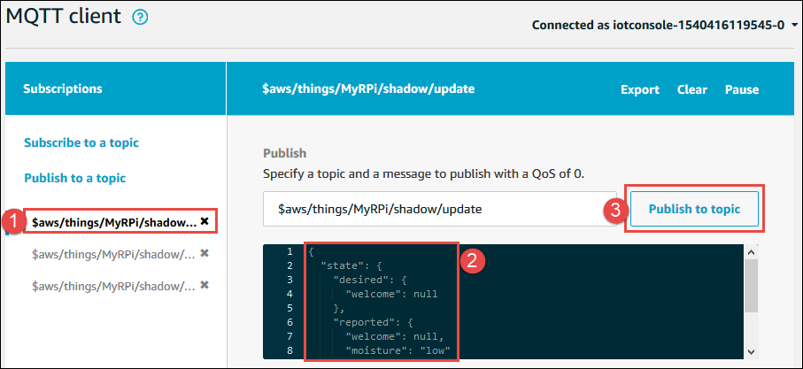

13. To get that data from the shadow, choose the MQTT topic value for ***Get this device shadow*** (for example, 
***$aws/things/MyRPi/shadow/get***).

14. In the message payload area, replace the current payload with the following payload:
    
```
{}
                   
```   

   You specify empty curly braces here because the Get this 
    thing shadow MQTT topic takes only an empty payload.
    
15. Choose ***Publish to topic***.

 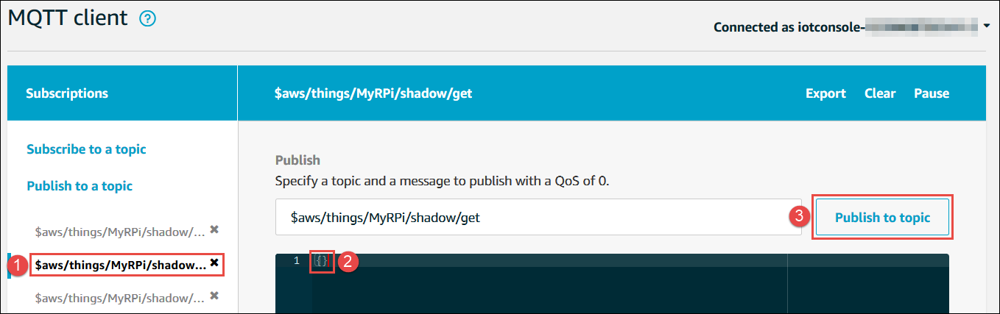

   A green dot is displayed next to the MQTT value for ***Get this device shadow accepted***. This 
    means that there is new information displayed for that MQTT topic.
    
  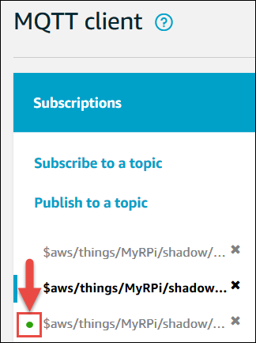

16. Choose the MQTT topic value for ***Get this device shadow accepted*** (for example, 
$aws/things/MyRPi/shadow/get/accepted), and note the output, for example:

 ```
   "state": {
     "reported": {
       "moisture": "low"
     }
   },
   "metadata": {
     "reported": {
       "moisture": {
         "timestamp": 1539272338
       }
     }
   },
   "version": 19,
   "timestamp": 1539272436
 }
```   
In the preceding output, the moisture value that was reported earlier is shown, along with
 the time each corresponding event happened and the current shadow document version.

17. Make another update to the shadow. To do this, in the MQTT client navigation pane, choose the MQTT topic value for 
***Update to this device shadow*** (for example, ***$aws/things/MyRPi/shadow/update***).

18. In the message payload area, replace the current payload with the following payload to change the current moisture 
value:

```
{
  "state": {
    "reported": {
      "moisture": "okay"
    }
  }
}
```

19. Choose Publish to topic.

20. Choose the MQTT topic value for Get this device shadow (for example, $aws/things/MyRPi/shadow/get).

21. In the message payload area, replace the current payload with the following payload:

```
{}
                   
```  
22. Choose ***Publish to topic***. A green dot is displayed next to the MQTT value for ***Get this device shadow 
accepted***.

23. Choose the MQTT topic value for ***Get this device shadow accepted*** (for example, 
***$aws/things/MyRPi/shadow/get/accepted***)
, and note the output, for example:

```
{
  "state": {
    "reported": {
      "moisture": "okay"
    }
  },
  "metadata": {
    "reported": {
      "moisture": {
        "timestamp": 1539272823
      }
    }
  },
  "version": 20,
  "timestamp": 1539272827
}
```

In the preceding output, the moisture value that was just changed is shown, along with the time that each corresponding 
event happened and the new current shadow document version.

### Step 4: Set Up Text Message Alerts for Low Moisture Readings

In this step, you set up Amazon Simple Notification Service (Amazon SNS) to automatically send a text message  alert to
 the houseplant’s owner as a reminder to water it whenever the soil moisture level is too low.

1. Create an AWS IoT rule to trigger the email alert through Amazon SNS. To do this, with the AWS IoT console open, in
 the service navigation pane, choose Act.
 
 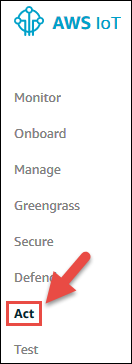
 
 2. If a ***You don’t have any rules yet*** dialog box appears, choose ***Create a rule***. Otherwise, choose ***Create***.
 
 3. On the ***Create a rule*** page, enter a Name for this rule, for example, ***MyRPiLowMoistureAlertRule***. If you use a 
 different name, be sure to substitute it throughout this sample.
 
 4. For ***Description***, provide a meaningful description for this rule, for example, ***Sends an alert whenever soil moisture
  level readings are too low***.
 
 5. For ***Rule query statement***, with ***Using SQL version*** set to ***2016-03-23***, in the ***Rule query statement*** box, enter the 
 following AWS IoT SQL statement as a single line, without any line breaks:
 
```
SELECT * FROM '$aws/things/MyRPi/shadow/update/accepted' WHERE state.reported.moisture = 'low'
```
### Step 11: Capture Data from the Soil Moisture Sensor Kit

1. Use an available code editor on the Raspberry Pi (for example, nano, IDLE, or vi) to create a file with the following code.

To review ***moisture.py*** file click [here](./code/moisture.py)

2. Then run ***python3 moisture.py***

3. Every 5–10 seconds, place the prongs on the sensor module into a glass of water, or remove the prongs from the water. Every 5 seconds, Python prints No water detected or Water detected!, depending on whether the prongs are in the water.

4. When you’re done, stop running the script by pressing ***Ctrl+C***.


## Resources 
***Setting Up AWS IoT and Sending Data with Your Development Computer***
https://docs.aws.amazon.com/iot/latest/developerguide/iot-plant-module1.html

***Capture Data from the Soil Moisture Sensor Kit***
https://docs.aws.amazon.com/iot/latest/developerguide/iot-plant-step11.html

***Send Soil Moisture Sensor Readings to AWS IoT***
https://docs.aws.amazon.com/iot/latest/developerguide/iot-plant-step12.html


