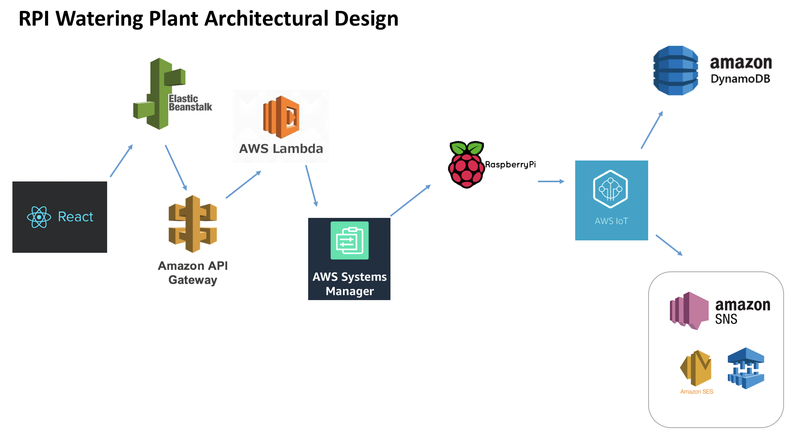

# AWS setup / Raspberry Pi Documentation

This repo contains the code that lives in the Raspberry Pi (RPI), a step-by-step on how to setup RPI and connect to 
AWS, along with all the services used to have the application talk to AWS in which AWS triggers the RPI.

## Authors

Liz Mahoney, Jorie Fernandez, Jen Shin, Greg Chidrome

## Architectural Design

- React - Frontend application
- Elastic Beanstalk - Deployed application is stored in elastic beanstalk
- Amazon API Gateway - Routes to call auto on, auto off, and water once 
- AWS Lambda - Invokes systems manager to trigger the RPI
- AWS Systems Manager - Registers a RPI to control the Pi 
- Raspberry Pi - The device to water the plant
- AWS IoT Core - IoT Core is a managed cloud service that lets connected devices easily and securely interact with cloud applications and other devices
    - AWS DynamoDB - RPI sends data to DynamoDB to store low moisture data.
    - AWS SES - The subscribed user will receive a low moisture email notification
    - AWS SMS - The subscribed user will receive a low moisture text message notification
    

# Table of contents

- [Instructions to set up Raspberry Pi ](./SETUP_RPI_README.md) 
- [Setup RPI with AWS IOT service](./IOT_README.md)
- [Setup with AWS Systems Manager](./AWS_SM_README.md)
- [Setup with AWS Lambda](./AWS_LAMBDA_README.md)
- [Setup with AWS API Gateway](./AWS_API_GATEWAY_README.md)

# AWS Service-related Issue
- AWS SMS failed to send text messages -> known service bug 

# RPI code
- [Auto water on](./code/auto_water_on.py)
- [Water once](./code/water_once.py)

