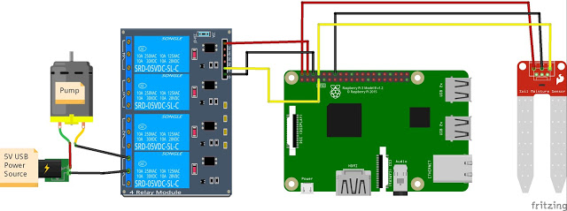

[Back](./README.md)

# Raspberry Pi Setup with Python

This repo contains the Raspberry Pi setup and python scripts.

## Authors 
Liz Mahoney, Jen Shin, Greg Chidrome, Jorie Fernandez


# Getting Started
1. On local machine, create a directory: `mkdir python-h20`
2. Go into the directory: `cd python-h20`, then clone this repo `git clone https://github.com/pi-H20/pi-python.git`
3. Voila! You should see all the files in this repo on your machine.

## Raspberry Pi Setup

Water Plant Tutorial - http://www.cyber-omelette.com/2017/09/automated-plant-watering.html

### Materials
- rpi 3b+
- water pump
- 2 channel relay
- moisture sensor
- 5v power supply
- clear water tube

### GPIO Layout



Following this GPIO layout:

Water Sensor -  plug the positive lead from the water sensor to pin 2, and the negative lead to pin 6. Plug the signal wire (yellow) to pin 8.

Relay - Plug the positive lead from pin 7 to IN1 on the Relay Board. Also connect Pin 2 to VCC, and Pin 5 to GND on the Relay board.

Pump - Connect your pump to a power source, run the black ground wire between slots B and C of relay module 1 (when the RPi sends a LOW signal of 0v to pin 1, this will close the circuit turning on the pump).

This diagram should capture the correct GPIO so long as you are using Raspberry Pi 3. Not shown is another power source to the RPi.


## Write some code to turn the pump on from the command line
***Note*** Before these next steps, the laptop can be able to ssh into Raspberry Pi to write any code!

1. Make a directory called water and go into the water directory.

2. To ensure the library is installed on the Raspberry pi, run: 

`sudo python3 -m pip install RPi.GPI` 

If successful, it shows the following: 

```
Looking in indexes: https://pypi.org/simple, https://www.piwheels.org/simple
Requirement already satisfied: RPi.GPIO in /usr/lib/python3/dist-packages (0.6.5

```

3. Open and create a new file `vim water.py`
4. After the file is done, it needs execute permissions, therefore run `chmod 777 water.py`
5. To run the file: `python3 water.py`

The pump should successfully run from the raspberry pi.

6. To edit the file: `vim water.py`

## Resources

***Water Plant Tutorial***
http://www.cyber-omelette.com/2017/09/automated-plant-watering.html


[Back](./README.md)